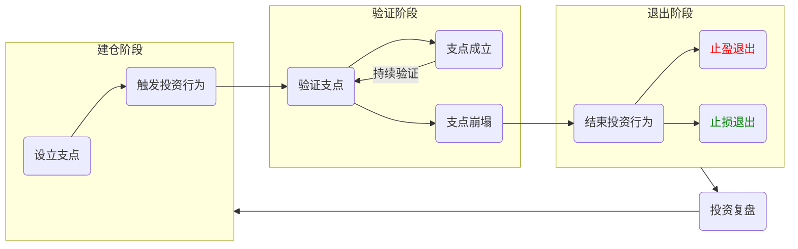

# 支点投资法

所谓「支点投资法」，就是要先为个人所有的投资行为寻找一个逻辑支点，之后随着时间的推移，不断去验证这个支点还存不存在。一旦这个支点消失，就要毅然决然地选择结束这次投资行为。

| 建仓阶段 | 验证阶段 | 退出阶段 |
| -- | -- | -- |
| 寻找这次投资行为的逻辑支点 触发相应的投资行为 | 不断验证投资支点： 如果支点的逻辑还成立，持续持有当前投资标的； 如果支点的条件已经不存在，进入投资的退出阶段 | 只要投资支点不存在了，都应该**坚定不移地退出** 止盈退出 止损退出 投资过程是提升投资水平的宝贵经验 |

*止盈和止损的本质是统一的，都是在投资支点崩塌之后的退出行为。*

## 投资闭环 —— 投资复盘

**只经历失败是没有价值的，成功的关键在于，能不能把失败的经验融入到个人的投资体系中去！**

在实践中，需要搭建一个闭环的投资体系，能够吸收失败的经验，成为越来越专业的投资者。

支点投资法是开放式的，针对的是独立的一次投资。为了建立投资闭环，需要对它进行一个小小的改造，就是在退出阶段之后加上「投资复盘」的环节（如下图）。不仅要复盘这次投资中成功的经验，还要复盘失败的经验，让它们都沉淀到投资体系里。

## 建立投资跟踪表

简单来说，投资跟踪表就像一个漏斗一样，把最初的投资想法一层层过滤成可投资的支点，再记录下从投资到退出的整个过程，最后针对整个过程进行复盘。

投资跟踪表主要分为“头脑风暴阶段”、“支点研究阶段”和“投资跟踪阶段”三大部分。

第一个阶段是“头脑风暴阶段”，主要负责记录发现的任何可能的投资机会。这些机会可能是自己在观察熟悉的投资标的时发现的，可能是与别人讨论时得出的，也可能是看了某些文章，听了某位专家介绍，觉得有道理而记下的。总之，只要有新的投资想法，都要新开一条记录，不用管这个想法靠不靠谱，因为这个阶段的目的就是为积累大量的支点素材。

第二个阶段是“支点研究阶段”，这个阶段的目的是把非常粗糙的支点素材打磨成一个可行的投资行为。它就像一个漏斗，把不靠谱的，或者优先级不高的支点素材过滤掉。如果通过研究，发现自己的支点站不住脚，就应该把这个支点停止在研究阶段，不要进一步触发实质的投资行为。

第三个阶段是实际执行的“投资跟踪阶段”，应该根据支点投资法，详细记录投资行为触发和退出的时间，以及触发退出的逻辑。并且，在一切都尘埃落定之后，复盘整个投资过程，把复盘的关键点记录下来，供之后进行投资时参考。

*如果能够坚持下来，记录到第 10 条的时候，就能切实地感受到自己的进步；记录到第 50 条的时候，就会有在财富管理赛道上“升了一级”的感觉。*

## 忠告

在任何市场，做空思想对散户来说都是极难掌握的。再次强调，如果没有极强的做空信号，不要进行任何做空交易。

*做空本质上不是一个“跟时间做朋友”的操作。*

“让利润奔跑”，在市场陷入疯狂的时候，最好的方案可能是跟着它继续疯，一直等到疯狂结束（出现一个明显的回撤）收割利润。
