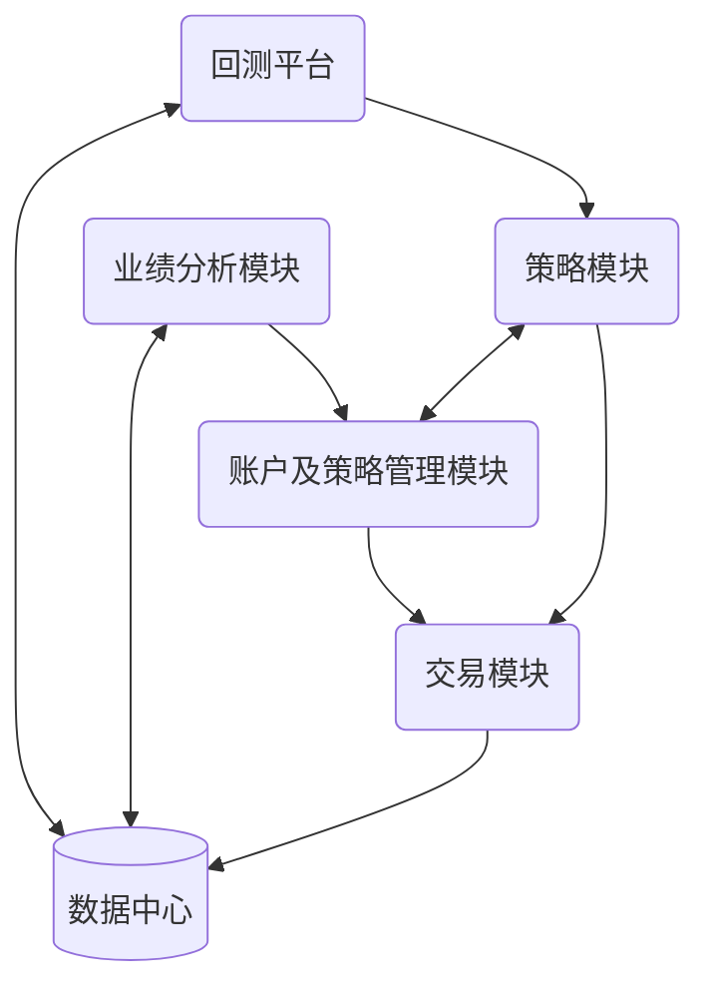

# 量化投资

量化投资，就是利用数据和模型来驱动的投资方式，一般都通过计算机系统实现。在量化投资中，我们会在投资的各个环节使用数学模型。例如，根据金融市场的历史数据建立数学模型，来预测股票等证券未来的涨跌幅，以及它们价格的波动程度、相关性等。再比如，利用量化模型和计算机程序来有效地执行交易，甚至从交易中持续获利。

## 量化投资系统的框架

常见的典型框架：
它由六大模块组成：账户及策略管理模块、策略模块、交易模块、回测平台、业绩分析模块和数据中心。

六个模块分工各不相同，形成了一个良性的迭代闭环。
- 账户及策略管理模块：简称管理模块，是整个系统的管理者，它负责调度所有的模块执行相应的任务，对系统进行顶层的管理；
- 策略模块：是各种投资策略的仓库，你可以把它理解成若干位不同投资风格的投资经理，每位投资经理根据自己的投资信号或模型，生成相应的投资决策；
   策略模块能否准确地预测投资标的的趋势，直接决定了系统盈利能力的高低。
- 交易模块：是执行者，它负责在接收到管理模块或策略模块的指令后，调用外部的交易接口，执行具体的交易操作；
- 回测平台：类似于机器学习中的离线测试平台，用于试验各种新策略；
- 业绩分析模块：是裁判，它会公平地评判各个策略的盈亏情况和各个环节的运行情况，把评判结果发给管理模块，让管理者知道哪些策略和环节需要改进；
- 数据中心：它用来存储整个系统的所有交易、回测、持仓和盈亏数据。
